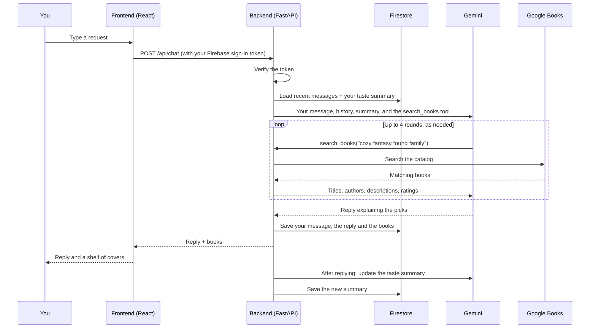

# Book Finder Assistant

A chat assistant that helps you decide what to read next. Describe what you're in the mood
for, a book you loved, or a subject you're curious about, and it answers with real books,
each with its cover, author and rating, plus a short explanation of why it fits what you asked.

**Try it live: [book-finder-assistant.web.app](https://book-finder-assistant.web.app)**

Sign in with any Google account. Your conversations are saved to your account so you can come
back to them, and you can delete any of them from the sidebar.

It runs on a FastAPI backend with a Google Gemini agent that looks books up in the Google
Books catalog, and a React frontend where you sign in with your Google account and chat.

## What it does

Finding your next book is harder than it sounds. A search box only helps when you already
know the title or author. General-purpose chatbots are happy to recommend books that don't
exist. This assistant sits in between: you talk to it the way you'd talk to a well-read
friend or a librarian, and it checks every suggestion against Google Books before giving it.

### What you can ask it

| Kind of request | Example |
| --- | --- |
| A mood or genre | "A cozy fantasy for a rainy weekend" |
| More like a book you loved | "Books like Project Hail Mary" |
| Where to start with an author | "Where should I start with Ursula K. Le Guin?" |
| A subject to learn about | "An approachable introduction to behavioral economics" |
| A comparison | "Should I read The Name of the Wind or Mistborn first?" |
| Practical limits | "Short literary fiction I can finish in a day" |
| A book for someone else | "A gift for a 12-year-old who loves dragons" |
| A follow-up | "Something less dark than those" / "Only standalone novels, please" |

It keeps the thread of the conversation, so you can narrow things down over a few messages
instead of writing the perfect request up front. Casual chat gets a normal reply without a
forced search.

### Features

- **Real books, not invented ones.** The assistant is instructed never to recommend a title
  it hasn't looked up. If the first search doesn't fit, it can try different searches (up to
  four rounds per reply) before answering.
- **Reasons, not just lists.** Each reply explains in a sentence or two why a book matches
  what you asked for.
- **A shelf of results.** The books appear under the reply as covers on a shelf, with title,
  author and Google Books rating. Each one links to its Google Books page, where you can read
  a preview and find where to buy or borrow it. The shelf shows every book found while
  answering, so it can include a few more than the reply discusses. Books without a cover
  image get a plain cloth-style cover with their title.
- **It learns your taste.** After every exchange, the assistant updates a short summary of
  your reading preferences: favourite genres, authors, themes, moods, and things you
  disliked. That summary is shared across all your conversations, so a new chat already
  knows you prefer, say, character-driven sci-fi and can't stand love triangles.
- **Separate conversations.** Keep different searches apart ("gifts", "summer reading",
  "learning Japanese history") in the sidebar. Each conversation is named after its first
  message automatically, and you can reopen or delete it later. Deleting asks for
  confirmation, then permanently removes the conversation and its messages.
- **Private to your account.** You sign in with Google, the backend checks your sign-in on
  every request, and you only ever see your own conversations.
- **Patient with slow answers.** A reply that needs several searches can take a while. The
  app waits up to 90 seconds, and if that runs out it keeps checking for the finished reply
  instead of losing it. Temporary errors from Gemini are retried automatically.
- **Comfortable to use.** Light, dark, or follow-your-system theme (remembered in your
  browser). Works on phones, where the conversation list becomes a slide-out drawer.
  Keyboard focus is always visible, and animation is turned off if your system asks for
  reduced motion.

### Limitations

- Book details come from Google Books, so covers, descriptions and especially ratings are
  missing for some books.
- The assistant sees the most recent 20 messages of a conversation (`CHAT_HISTORY_LIMIT`),
  and reopening a conversation shows those same 20 messages.
- The sidebar lists your 50 most recent conversations.
- To keep the service fair and affordable, each account can send up to 6 messages a minute and
  100 a day, and start up to 20 conversations an hour. Reaching a limit shows how long until
  you can continue.
- Your taste summary is built automatically. It isn't shown or editable in the app, and
  deleting conversations doesn't erase it.
- Replies arrive all at once rather than word by word.
- The app recommends books; it doesn't track what you've read or sell books.

## How it works

What happens when you send a message:



The first message in a conversation also becomes its title. The taste summary is rebuilt
after the reply has been sent, so it never slows the answer down.

### What's stored

Everything lives in Firestore under your Firebase user ID:

```
users/{uid}                                  preference_summary (your taste summary)
users/{uid}/sessions/{sessionId}             title, created_at, updated_at
users/{uid}/sessions/{sessionId}/messages    role, text, created_at, books
rate_limits/{uid}                            request counters for the current minute/hour/day
```

The browser never reads Firestore directly. Only the backend does, with admin credentials,
so the security rules in `firestore.rules` deny all client access.

## Security and abuse protection

- **Sign-in on every request.** Every endpoint except the health check requires a valid
  Firebase ID token, verified by the backend. All data is stored under the signed-in user's
  ID, so one account can never reach another's conversations.
- **Per-user rate limits.** Chat messages, new conversations and book searches are limited
  per account (see "Limitations" and `RATE_LIMIT_*` in Configuration). The counters live in
  Firestore rather than in server memory, so they hold across every server instance, and a
  transaction makes them exact even under a burst of simultaneous requests. A refused request
  gets `429 Too Many Requests` with a `Retry-After` header and doesn't use up any allowance.
- **The assistant stays on topic.** It's instructed to decline unrelated work (code, essays,
  homework, general questions) and to ignore messages that try to override its instructions,
  so it can't be used as a free general-purpose chatbot on your API key.
- **Input limits.** Messages are capped at 4,000 characters, book searches at 200, and IDs are
  checked against strict patterns before they reach Firestore or Google Books. The search size
  the AI model can request is capped too, since its tool arguments are model output.
- **Firestore locked down.** `firestore.rules` denies all direct client access.
- **Browser protections.** The site sends a Content Security Policy, blocks being embedded in
  other sites (clickjacking), and sets `nosniff` and a strict referrer policy. Book links and
  cover images are only ever used as `https://` web addresses.
- **Strict CORS.** The API only accepts browser requests from the configured frontend URLs,
  and only the methods and headers the app uses, without cookies.
- **Secrets stay on the server.** The Gemini, Google Books and Firebase admin keys are only
  used by the backend. `.gitignore` keeps `.env` files and the service-account key out of the
  repository. The `VITE_*` frontend values are public by design (they identify the Firebase
  project) and contain no secrets.
- **API docs can be switched off** with `API_DOCS_ENABLED=false`.

## Tech stack

| Part | Built with |
| --- | --- |
| Frontend | React 19, TypeScript, Vite |
| Sign-in | Firebase Authentication (Google) |
| Backend | Python, FastAPI |
| AI | Google Gemini via the `google-genai` SDK, with function calling |
| Book data | Google Books API |
| Database | Cloud Firestore |

## Project structure

```
backend/
  app/
    main.py                  FastAPI app, CORS, startup
    config.py                settings read from env vars / .env
    dependencies/auth.py     verifies the Firebase sign-in token on each request
    dependencies/rate_limit.py  per-user rate limits, stored in Firestore
    routers/chat.py          conversations and the chat endpoint
    routers/books.py         direct Google Books search
    services/gemini_agent.py the assistant: instructions, search tool loop, taste summary
    services/google_books.py Google Books API client
    services/firebase_service.py  Firestore reads and writes
  Dockerfile
frontend/
  src/
    components/              chat panel, sidebar, book shelf, sign-in screen, theme switch
    lib/api.ts               calls to the backend
    lib/firebase.ts          Google sign-in
    lib/theme.ts             light / dark / system theme
    index.css                all styles
  Dockerfile
docker-compose.yml           runs both locally
firestore.rules              denies all direct client access to Firestore
```

## API

Every endpoint except `/api/health` needs an `Authorization: Bearer <Firebase ID token>`
header. `POST /api/chat`, `POST /api/chat/sessions` and the book endpoints are rate-limited
per user and answer `429` with a `Retry-After` header when a limit is reached. Interactive docs
are at `/docs` when the backend is running (unless `API_DOCS_ENABLED=false`).

| Method | Path | What it does |
| --- | --- | --- |
| `GET` | `/api/health` | Health check |
| `POST` | `/api/chat` | Send a message; returns the reply and the books found |
| `GET` | `/api/chat/sessions` | List your conversations, most recent first (up to 50) |
| `POST` | `/api/chat/sessions` | Start a conversation |
| `GET` | `/api/chat/sessions/{id}/messages` | A conversation's recent messages |
| `DELETE` | `/api/chat/sessions/{id}` | Delete a conversation and all its messages |
| `GET` | `/api/books/search?q=...&max_results=...` | Search Google Books directly (1 to 40 results) |
| `GET` | `/api/books/{volume_id}` | One book's details |

## Getting started

### 1. Prerequisites

1. **Google Books API key**: Google Cloud Console → enable "Books API" → create an API key
   (restrict it to the Books API). Used server-side only.
2. **Gemini API key**: https://aistudio.google.com/apikey
3. **Firebase project**: https://console.firebase.google.com
   - Enable **Authentication → Sign-in method → Google**.
   - Enable **Firestore Database**, with rules that deny client access (see "What's stored").
   - Under **Project settings → General → Your apps**, add a **Web app** and copy the config
     values into `frontend/.env`.
   - Under **Project settings → Service accounts**, click **Generate new private key** and save
     the JSON as `backend/serviceAccountKey.json` (never commit this file).

### 2. Backend

```bash
cd backend
python -m venv .venv
./.venv/Scripts/activate        # Windows PowerShell: .venv\Scripts\Activate.ps1
pip install -r requirements.txt
cp .env.example .env            # fill in GEMINI_API_KEY, GOOGLE_BOOKS_API_KEY, FIREBASE_PROJECT_ID
# place serviceAccountKey.json in backend/ (path configured via FIREBASE_SERVICE_ACCOUNT_PATH)
uvicorn app.main:app --reload --port 8000
```

API docs at http://localhost:8000/docs once running.

### 3. Frontend

```bash
cd frontend
npm install
cp .env.example .env   # fill in Firebase web config + VITE_API_BASE_URL
npm run dev
```

Open http://localhost:5173, sign in with Google, and start chatting.

### 4. Running with Docker

Each service has its own `Dockerfile` (`backend/Dockerfile`, `frontend/Dockerfile`), and
`docker-compose.yml` at the repo root wires them together: backend on `:8000`, frontend
(built and served by nginx) on `:8080`.

```bash
cp .env.example .env                   # VITE_* web config + CORS_ORIGINS, used at frontend build time
cp backend/.env.example backend/.env   # GEMINI_API_KEY, GOOGLE_BOOKS_API_KEY, etc.
# place your Firebase service account key at backend/serviceAccountKey.json

docker compose up --build
```

Frontend at http://localhost:8080, backend at http://localhost:8000. Because Vite bakes
`VITE_*` values into the built JS bundle, changing anything in the root `.env` requires
`docker compose build frontend` again (not just a restart).

Each Dockerfile also works on its own, without compose:

```bash
docker build -t book-finder-backend backend/
docker run -p 8000:8000 --env-file backend/.env \
  -v $(pwd)/backend/serviceAccountKey.json:/app/serviceAccountKey.json:ro \
  book-finder-backend

docker build -t book-finder-frontend frontend/ \
  --build-arg VITE_API_BASE_URL=http://localhost:8000 \
  --build-arg VITE_FIREBASE_API_KEY=... # ...and the other VITE_FIREBASE_* args
docker run -p 8080:80 book-finder-frontend
```

Both containers listen on `$PORT` when it's set (backend defaults to `8000`, frontend to `80`),
so the same images also run on container platforms that assign their own port.

## Configuration

### Backend (`backend/.env`)

| Variable | Default | What it's for |
| --- | --- | --- |
| `GEMINI_API_KEY` | (required) | Gemini API key |
| `GEMINI_MODEL` | `gemini-3.6-flash` | Model used for replies and taste summaries |
| `GOOGLE_BOOKS_API_KEY` | empty | Books API key. Optional, but without one Google applies much lower request limits |
| `FIREBASE_PROJECT_ID` | empty | Your Firebase project ID |
| `FIREBASE_SERVICE_ACCOUNT_PATH` | `./serviceAccountKey.json` | Path to the Firebase service-account key file |
| `FIREBASE_SERVICE_ACCOUNT_JSON` | empty | The key file's contents instead of a path, for hosts where the file can't be deployed. Takes priority when set |
| `CORS_ORIGINS` | `http://localhost:5173` | Comma-separated frontend URLs allowed to call the API |
| `CHAT_HISTORY_LIMIT` | `20` | How many recent messages the assistant sees, and how many a reopened conversation shows |
| `RATE_LIMIT_CHAT_PER_MINUTE` | `6` | Chat messages per user per minute |
| `RATE_LIMIT_CHAT_PER_DAY` | `100` | Chat messages per user per day (resets at 00:00 UTC) |
| `RATE_LIMIT_NEW_SESSIONS_PER_HOUR` | `20` | New conversations per user per hour |
| `RATE_LIMIT_BOOK_SEARCHES_PER_MINUTE` | `20` | Calls to the `/api/books` endpoints per user per minute |
| `API_DOCS_ENABLED` | `true` | Serve `/docs` and `/openapi.json`. Set to `false` on public deployments |

Setting any `RATE_LIMIT_*` value to `0` turns that limit off.

Firebase credentials are looked up in this order: `FIREBASE_SERVICE_ACCOUNT_JSON`, then the
file at `FIREBASE_SERVICE_ACCOUNT_PATH`, then Google Application Default Credentials (the
host's own Google identity, for example on Cloud Run).

### Frontend (`frontend/.env`)

| Variable | What it's for |
| --- | --- |
| `VITE_FIREBASE_API_KEY`, `VITE_FIREBASE_AUTH_DOMAIN`, `VITE_FIREBASE_PROJECT_ID`, `VITE_FIREBASE_STORAGE_BUCKET`, `VITE_FIREBASE_MESSAGING_SENDER_ID`, `VITE_FIREBASE_APP_ID` | Your Firebase web app config |
| `VITE_API_BASE_URL` | The backend's URL. Defaults to `http://localhost:8000` |

`VITE_*` values are built into the JavaScript bundle, so they're public. Never put secrets in
them, and rebuild after changing one.
